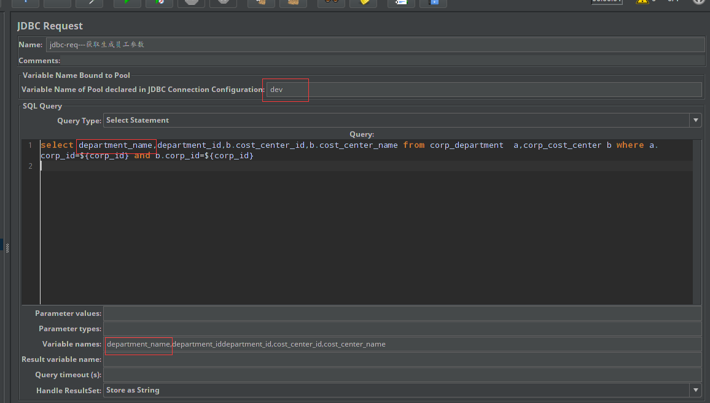
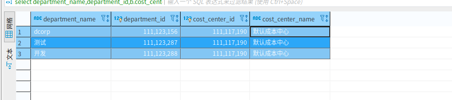
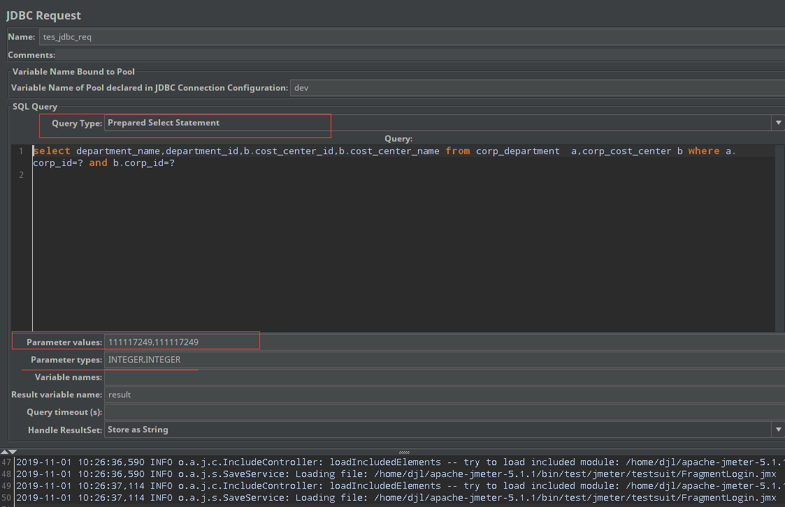
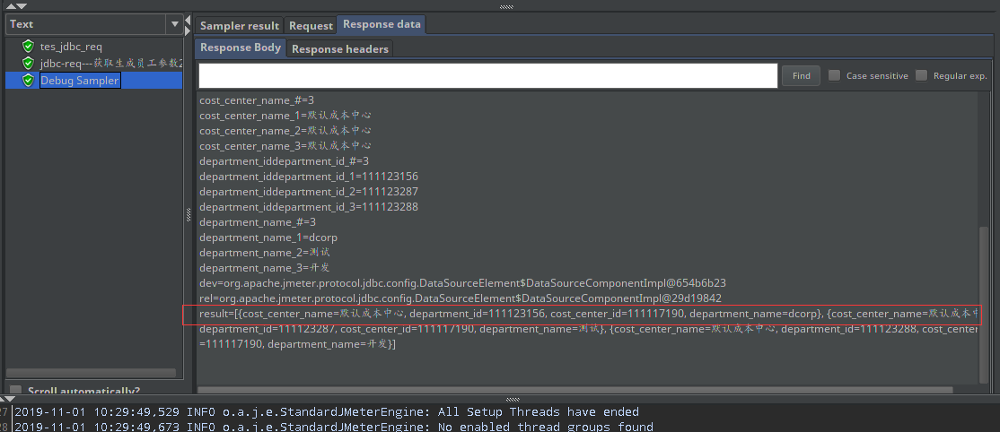

# 1、JDBC Request
此sampler需要配合jdbc connection configuration使用

jdbc-request实例

如果提供了变量名(Variable Names)列表，那么对于Select语句(Select statement)返回的每一行，将用相应列的值设置变量(如果提供了变量名)，并设置行数。
例如，如果Select语句返回4列的3行，而变量列表是 A,B,C,D 则会设置以下变量:

1. cost_center_id_#=3 (number of rows)
2. cost_center_id_1=111117190   column 1, row 1
3. cost_center_id_2=111117190   column 1, row 2
4. 

jdbc-request参数说明
1. Variable Name：数据库连接池的名字，需要与JDBC Connection Configuration的
2. Variable Name Bound Pool名字保持一致 
3. Query Type：此处支持方式多样，可以用于添加或者筛选数据，根据需要和Query配合使用； 
4. Query：填写的sql语句未尾不要加“;” 
5. Parameter valus：参数值，顺序替代Query中的?； 
6. Parameter types：参数类型，可参考：Javadoc for java.sql.Types 
7. Variable names：保存sql语句返回结果的变量名 ，用于作为参数供调用 
8. Result variable name：创建一个对象变量，保存所有返回的结果 ，供调用； 
9. Query timeout：查询超时时间 
10. Handle result set：定义如何处理由callable statements语句返回的结果。

## JDBC Request配置　使用Parameter valus：
１.  如要使用Parameter valus，则Query Type就不能为Select Statement，会失败的，可以选择使用Prepared Select Statement,配置如下： 
 

##2、使用上一次查询结果作为参数（使用Result Variable names）
在上一张图中在Result Variable names　设置为　result
查询成功后，可以看到变量放置了查询的结果
 

