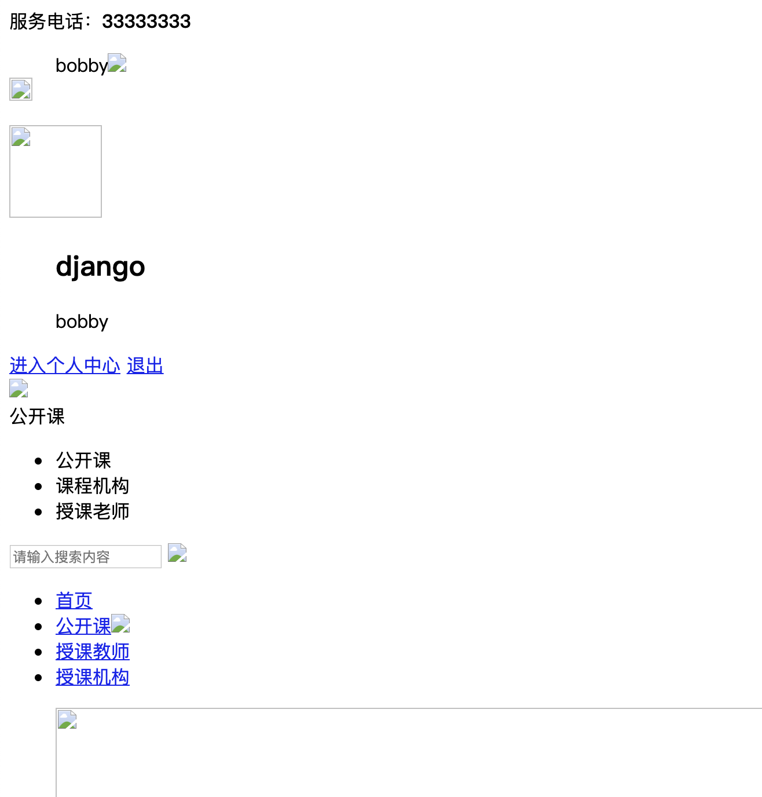

一. 显示首页--首页和登录页面的配置
 
1. 修改mxonline/setttings.py
在TEMPLATES代码块修改DIRS为 'DIRS': [os.path.join(BASE_DIR, 'templates')],
 
2. 修改mxonline/urls.py，添加一行首页path，并导入TemplateView
 
3. 在templates文件夹中加入index.html文件，
此时就可以通过http://127.0.0.1:8000访问首页了，但是没有样式



4. 新建static目录，把静态资源文件放到此目录下，并在mxonline/settings.py下添加设置

并且把index.html中的所有".." 替换成"/static" , 我没加前面的"/"也可以，经验证，可以在IE中正常显示样式，但是在chrome浏览器中样式是乱的


二. 显示login页面
 
1. 拷贝login.html到templates目录， 修改login.html中的".."为"static"
2. 在mxonline/urls.py中添加
>    path('/login/', TemplateView.as_view(template_name='login.html'), name='login'),
3. 查找templates/index.html中登录字样，将其中的href="login.html"修改为href="/login/"，并取消前后端的注释
4. 接着第3步的位置，点击紧接着下面一行的<div class="personal">前面的减号，收起代码段。暂时注释掉个人中心的代码，也就是在首页不显示用户登陆信息，最好先从后面写注释


三.  用户登录后台逻辑
```

def user_login(request):
    if request.method == 'POST':
        # 获取用户提交的用户名和密码
        user_name = request.POST.get('username', None)
        pass_word = request.POST.get('password', None)
        # 成功返回user对象,失败None
        user = authenticate(username=user_name, password=pass_word)
        # 如果不是null说明验证成功
        if user is not None:
            # 登录
            login(request, user)
            return render(request, 'index.html')
        else:
            return render(request, 'login.html', {'msg': '用户名或密码错误'})

    elif request.method == 'GET':
        return render(request, 'login.html',{})

```
修改mx_online/urls.py
>  path('login/', user_login, name='login'), 