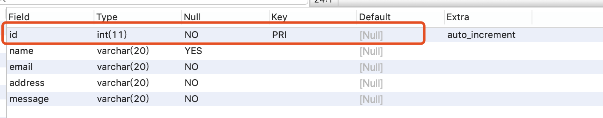
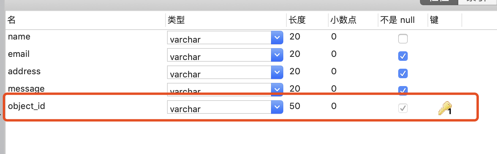
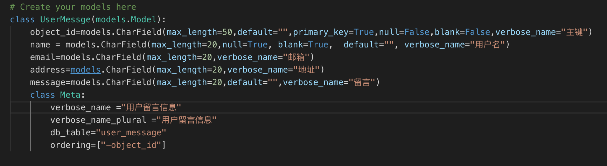
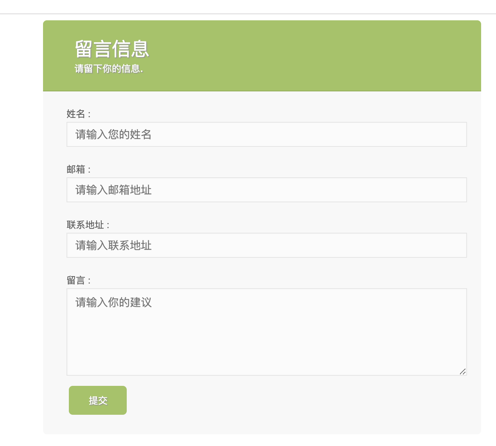
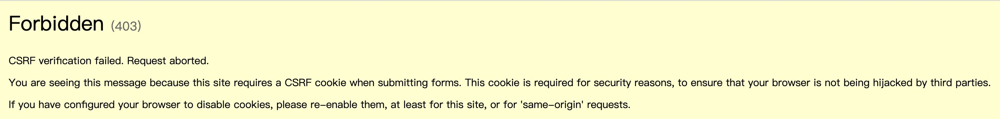
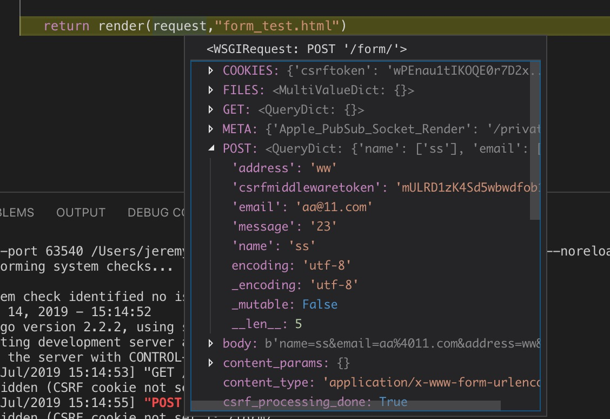

## 创建项目
#### 1.  通过命令行的方式，首先进入到安装django的虚拟环境中，然后执行命令
```
django-amin satrproject [项目名称]
```
这样就可以在当前目录下创建项目
#### 2. 通过pycharm创建项目
文件--->新建项目---->选择django---->创建项目


## 运行项目
1. 在终端，进入项目文件夹下，然后执行以下命令即可运行
````
python manage.py runserver
````
2. pycharm 


## 项目结构介绍
　mamage.py：与项目进行交互的命令行工具集的接口
　settings.py ：项目配置
 　urls.py ：路由设置
 
 ## project和app的关系
 >创建应用 python3 manage.py  startapp [app_name]
1. app是django项目的组成部分，一个app代表项目中的一个模块，所有URL响应都是由app来处理
2. django项目由许多app组成

## URL分发器
### 视图
 视图一般都写在 app 的 views.py 中。并且视图的第一个参数永远都是 request （一个HttpRequest）对象。这个对象存储了请求过来的所有信息，包括携带的参数以及一些头部信息
等。在视图中，一般是完成逻辑相关的操作。比如这个请求是添加一篇博客，那么可以通过request来接收到这些数据，然后存储到数据库中，最后再把执行的结果返回给浏览器。视图函数
的返回结果必须是 HttpResponseBase 对象或者子类的对象。示例代码如下：

````
def book(request):    
   return HttpResponse('图书首页')    
````


##  URL传递参数
####  1.URL映射

视图写完后，要与URL进行映射，也即用户在浏览器中输入什么 url 的时候可以请求到这个视图函数。在用户输入了某个 url ，请求到我们的网站的时候， django 会从项目的 urls.py 文件中寻找对应的视图。在 urls.py 文件中有一个 urlpatterns 变量，以后 django 就会从这个变量中读取所有的匹配规则。匹配规则需要使用 django.urls.path 函数进行包裹，这个函数会根据传入的参数返回 URLPattern 或者是 URLResolver 的对象。示例代码如下

#### 2. URL传参数
1. 采用在URL中使用变量的方式：在path的第一个参数中，使用“<参数名>”的方式可以传递参数。然后在视图函数中也要写一个参数，视图函数中的参数必须和url中的参数名称保持一致，不然就找不到参数。另外url中可以传递多个参数
2. 采用查询字符串的方式：
在url中，不需要单独的匹配查询字符串的部分。只需要在视图函数中使用“request.Get.get(‘参数名称’)”的方式进行获取
因为查询字符串使用的是Get请求，所以我们通过request.Get来获取参数，并且因为Get是一个类似于字典的数据类型，
所以获取值跟字典的方式都是一样的。

urls.py
>from django.contrib import admin
from django.urls import path
from myapp import views
urlpatterns = [
    path('admin/', admin.site.urls),
    path('',views.index),
    path('book/',views.index),
    path('book/bookid/<book_id>',views.book_id),
    path('book/bookname/',views.book_name)
]

views.py

>from django.shortcuts import render
from django.http import HttpResponse
def index(request):
    return HttpResponse("首页")
def book_id(request,book_id):
    text="您获取的图书id是：%s"%book_id
    return HttpResponse(text)
def book_name(request):
    book_name=request.GET.get("name")
    text="您获取的图书名称是：%s"%book_name
    return HttpResponse(text)

### 3.URL命名

#### 为什么需要url命名
因为Url是经常变化的，写死会经常要改
#### 如何给一个url指定的名称
>from django.urls import pathfrom . import  views               
>urlpatterns=[    path('',views.index,name='index'),    path('login/',views.login,name='login'),]
#### 应用命名空间
在 多个APP之间，有可能产生同名的URL，这时候为了避免翻转url的时候产生混淆
可以使用应用命名空间，来做区分
#### 应用命名空间和实例命名空间


### 4.自定义URL转换器
之前已经学到过一些django内置的 url 转换器，包括有 int 、 uuid 等。有时候这些内置的 url转换器 并不能满足我们的需求，因此django给我们提供了一个接口可以让我们自己定义自己的url转换器。
自定义 url 转换器按照以下五个步骤来走就可以了：
1..定义一个类。
2. 在类中定义一个属性 regex ，这个属性是用来保存 url 转换器规则的正则表达式。
3. 实现 to_python(self,value) 方法，这个方法是将 url 中的值转换一下，然后传给视图函数
的。
4. 实现 to_url(self,value) 方法，这个方法是在做 url 反转的时候，将传进来的参数转换后拼
接成一个正确的url。
5. 将定义好的转换器，注册到django中。
比如写一个匹配四个数字年份的 url 转换器。示例代码如下：
```

# 1. 定义一个类
class FourDigitYearConverter:
# 2. 定义一个正则表达式regex = '[0-9]{4}'# 3. 定义to_python方法def to_python(self, value):return int(value)# 4. 定义to_url方法def to_url(self, value):r
      eturn '%04d' % value
 # 5. 注册到django中
 from django.urls import register_converter
 register_converter(converters.FourDigitYearConverter, 'yyyy')
urlpatterns = [
path('articles/2003/', views.special_case_2003),
# 使用注册的转换器
path('articles/<yyyy:year>/', views.year_archive),
```
## 模板

在之前的章节中，视图函数只是直接返回文本，而在实际生产环境中其实很少这样用，因为实际的页面大多是带有样式的HTML代码，这可以让浏览器渲染出非常漂亮的页面。目前市面上有非常多的模板系统，其中最知名最好用的就是DTL和Jinja2。 DTL 是 Django Template Language 三个单词的缩写，也就是Django自带的模板语言。当然也可以配置Django支持Jinja2等其他模板引擎，但是作为Django内置的模板语言，和Django可以达到无缝衔接而不会产生一些不兼容的情况。因此建议大家学习好DTL


**DTL模板是一种带有特殊语法的HTML文件，这个HTML文件可以被Django编译，可以传递参数进去，实现数据动态化。在编译完成后，生成一个普通的HTML文件，然后发送给客户端。**

### 渲染模板

<u>渲染模板有多种方式。这里讲下两种常用的方式</u>
1.rander_to_string: 找到模板，然后将模板编译后渲染成Python字符串的格式，最后再通过HttpResponse类包装成一个HttpResponse对象返回回去
```
view.py

def  index(request):    
      html=render_to_string("front_temp/index.html")    
      return HttpResponse(html)
```
2. 直接将模板渲染成字符串并且包装成HttpResponse 对象一步完成
```

def  index(request):    
               # html=render_to_string("front_temp/index.html")   
               # return HttpResponse(html)   
               return render(request,'front_temp/index.html')
```

### 模板查找路径配置

在项目的 settings.py 文件中。有一个 TEMPLATES 配置，这个配置包含了模板引擎的配置，模板查找路径的配置，模板上下文的配置等。模板路径可以在两个地方配置。

1. DIRS: 这是一个列表，在这个列表中可以存放所有模板路径，以后在视图中使用render或者render_to_string 渲染模板的时候，会在这个列表中的路径去查找
2. APP_DIRS: 默认为true, 设置为True后，会在INSTALL_APPS的安装了的APP下的templates文件中查找模板
3. 查找顺序：比如代码 render('list.html') 。先会在 DIRS 这个列表中依次查找路径下有没有这个模板，如果有，就返回。如果 DIRS 列表中所有的路径都没有找到，那么会先检查当前这个视图所处的 app 是否已经安装，如果已经安装了，那么就先在当前这个 app 下的 templates 文件夹中查找模板，如果没有找到，那么会在其他已经安装了的 app 中查找。如果所有路径下都没有找到，那么会抛出一个 TemplateDoesNotExist 的异常。


### DTL模板语法
#### 变量：

模板中可以包含变量， Django 在渲染模板的时候，可以传递变量对应的值过去进行替换。变量的
命名规范和 Python 非常类似，只能是阿拉伯数字和英文字符以及下划线的组合，不能出现标点符
号等特殊字符。变量需要通过视图函数渲染，视图函数在使用 render 或者 render_to_string 的
时候可以传递一个 context 的参数，这个参数是一个字典类型。以后在模板中的变量就从这个字
典中读取值的。示例代码如下：
```

# profile.html模板代码
<p>{{ username }}</p>
# views.py代码def 
profile(request):
return render(request,'profile.html',context={'username':'huangyong'})
```

### 常用的模板标签


### 模板常用过滤器


### 数据库


映射模型到数据库中：将 ORM 模型映射到数据库中，总结起来就是以下几步：
1. 在 settings.py 中，配置好 DATABASES ，做好数据库相关的配置。
2. 在 app 中的 models.py 中定义好模型，这个模型必须继承自 django.db.models 。
3. 将这个 app 添加到 settings.py 的 INSTALLED_APP 中。
4. 在命令行终端，进入到项目所在的路径，然后执行命令 python manage.py makemigrations 来
生成迁移脚本文件。
>python3 manage.py makemigrations
>No changes detected
5. 同样在命令行中，执行命令 python manage.py migrate 来将迁移脚本文件映射到数据库中。
>Applying contenttypes.0001_initial... OK
  Applying auth.0001_initial... OK
  Applying admin.0001_initial... OK
  Applying admin.0002_logentry_remove_auto_add... OK
  Applying admin.0003_logentry_add_action_flag_choices... OK
  Applying contenttypes.0002_remove_content_type_name... OK
  Applying auth.0002_alter_permission_name_max_length... OK
  Applying auth.0003_alter_user_email_max_length... OK
  Applying auth.0004_alter_user_username_opts... OK
  Applying auth.0005_alter_user_last_login_null... OK
  Applying auth.0006_require_contenttypes_0002... OK
  Applying auth.0007_alter_validators_add_error_messages... OK
  Applying auth.0008_alter_user_username_max_length... OK
  Applying auth.0009_alter_user_last_name_max_length... OK
  Applying auth.0010_alter_group_name_max_length... OK
  Applying auth.0011_update_proxy_permissions... OK
  Applying sessions.0001_initial... OK

```
class UserMessge(models.Model):
    ###如果不指定主键，则在生成数据表的时候 会自动给一个主键
    name = models.CharField(max_length=20,null=True, blank=True,  default="", verbose_name="用户名")
    email=models.CharField(max_length=20,verbose_name="邮箱")
    address=models.CharField(max_length=20,verbose_name="地址")
    address=models.CharField(max_length=20,verbose_name="留言") 
    class Meta:
        verbose_name ="用户留言信息"

```
>自动生成数据表之后，django会自动添加id

增加一个主键到models中
```
object_id=models.CharField(max_length=50,default="",primary_key=True,null=False,blank=False,verbose_name="主键")
```





### Model的增删改
在view中导入model
```
# Create your views here.
import pymysql

from .models import UserMessge
#导入model  
def getform(request):
  return render(request,"form_test.html")
```
表单如下

点击提交

解决办法
加入csrf_token
```
    <label>
        <span>&nbsp;</span>
        <input type="submit" class="button" value="提交"/>

    </label>
     
    <!--<input type='hidden' name='csrfmiddlewaretoken' value='SfHkbL4feo1G00sJQtbO7TtLN4c2BUwa' />  -->
</form>

</body>
</html>

```
1.提交完成后

