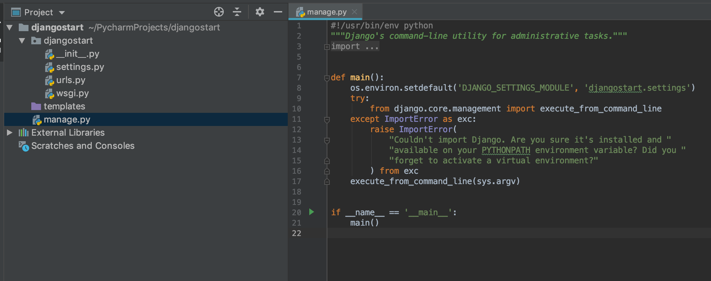
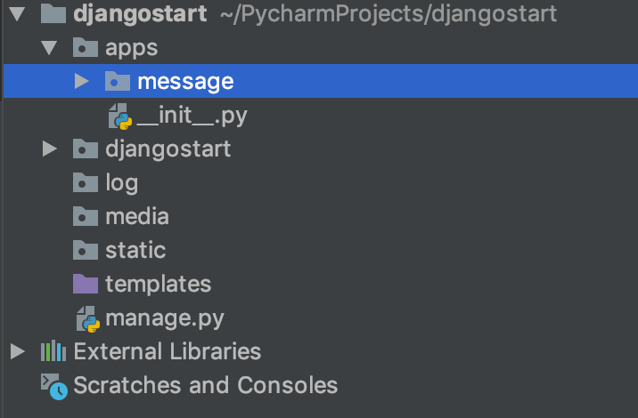

## django目录结构



## 快速搭建项目
1. 创建APP
   python3 manage.py startapp message

   
2. 配置项目文件夹
   1. 创建statci,log,media文件夹
   2. 创建apps文件夹，将应用放置在此文件夹下

    
3. 配置mysql
setting文件下配置mysql连接属性
```
ATABASES = {
    'default': {
        'ENGINE': 'django.db.backends.mysql',
        'NAME': "django",
        'USER':"root",
        'PASSWORD':"86680334",
        'HOST':"47.98.63.111",
    }
}

```


## djamgo  templates配置


