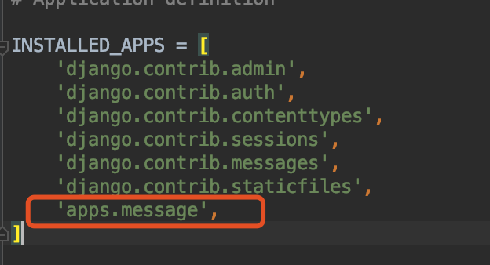

## django目录结构


## 快速搭建项目
1. 创建APP
   python3 manage.py startapp message

   
2. 配置项目文件夹
   1. 创建statci,log,media文件夹
   2. 创建apps文件夹，将应用放置在此文件夹下

    


3. 配置mysql
setting文件下配置mysql连接属性
```
ATABASES = {
    'default': {
        'ENGINE': 'django.db.backends.mysql',
        'NAME': "django",
        'USER':"root",
        'PASSWORD':"86680334",
        'HOST':"47.98.63.111",
    }
}

```
映射模型到数据库中：将 ORM 模型映射到数据库中，总结起来就是以下几步：
1. 在 settings.py 中，配置好 DATABASES ，做好数据库相关的配置。
2. 在 app 中的 models.py 中定义好模型，这个模型必须继承自 django.db.models 。
3. 将这个 app 添加到 settings.py 的 INSTALLED_APP 中。
  
4. 生成django默认的数据表
>python3 manage.py migrate
5. 在命令行终端，进入到项目所在的路径，然后执行命令 python manage.py makemigrations 来
生成迁移脚本文件。
>python3 manage.py makemigrations
>No changes detected
6. 同样在命令行中，执行命令 python manage.py migrate 来将迁移脚本文件映射到数据库中。
>Applying contenttypes.0001_initial... OK
  Applying auth.0001_initial... OK
  Applying admin.0001_initial... OK
  Applying admin.0002_logentry_remove_auto_add... OK
  Applying admin.0003_logentry_add_action_flag_choices... OK
  Applying contenttypes.0002_remove_content_type_name... OK
  Applying auth.0002_alter_permission_name_max_length... OK
  Applying auth.0003_alter_user_email_max_length... OK
  Applying auth.0004_alter_user_username_opts... OK
  Applying auth.0005_alter_user_last_login_null... OK
  Applying auth.0006_require_contenttypes_0002... OK
  Applying auth.0007_alter_validators_add_error_messages... OK
  Applying auth.0008_alter_user_username_max_length... OK
  Applying auth.0009_alter_user_last_name_max_length... OK
  Applying auth.0010_alter_group_name_max_length... OK
  Applying auth.0011_update_proxy_permissions... OK
  Applying sessions.0001_initial... OK

```
class UserMessge(models.Model):
    ###如果不指定主键，则在生成数据表的时候 会自动给一个主键
    name = models.CharField(max_length=20,null=True, blank=True,  default="", verbose_name="用户名")
    email=models.CharField(max_length=20,verbose_name="邮箱")
    address=models.CharField(max_length=20,verbose_name="地址")
    address=models.CharField(max_length=20,verbose_name="留言") 
    class Meta:
        verbose_name ="用户留言信息"

```
>自动生成数据表之后，django会自动添加id

增加一个主键到models中
```
object_id=models.CharField(max_length=50,default="",primary_key=True,null=False,blank=False,verbose_name="主键")
```


## djamgo  templates配置


