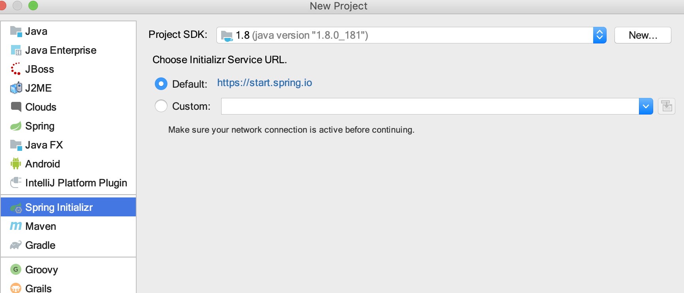
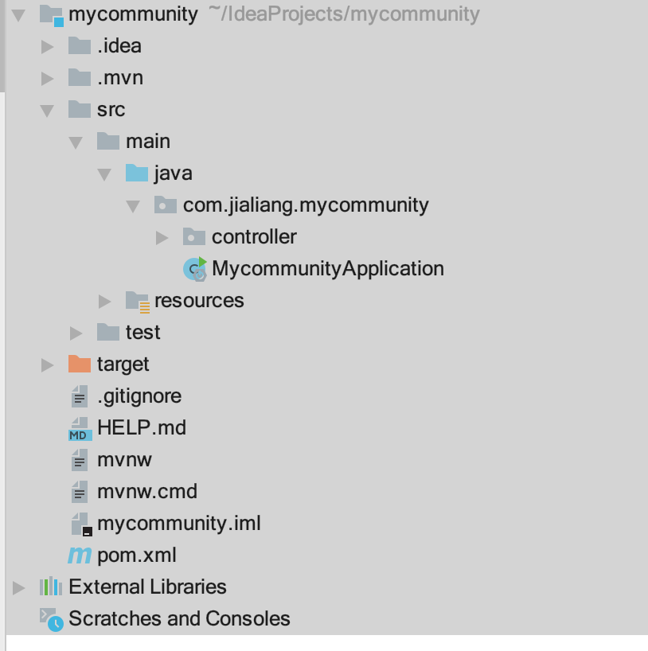
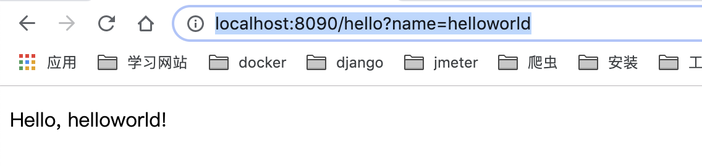
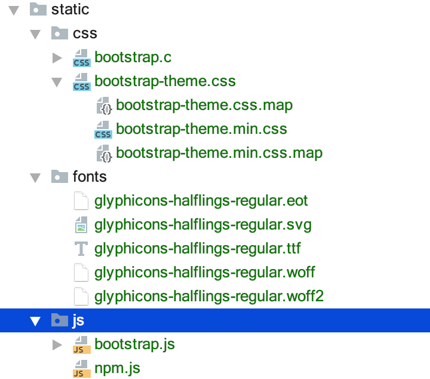
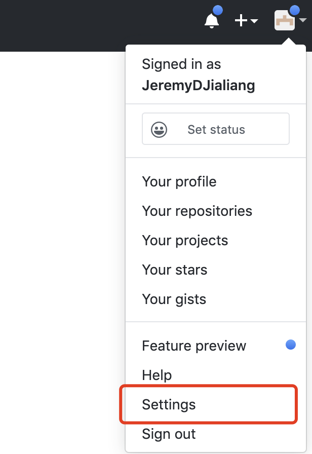
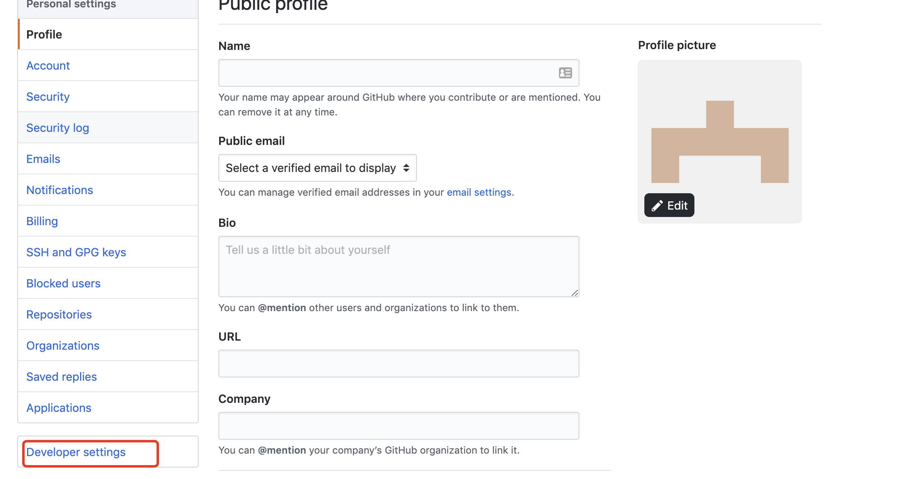
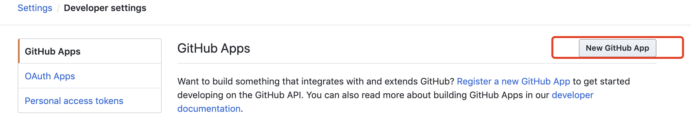
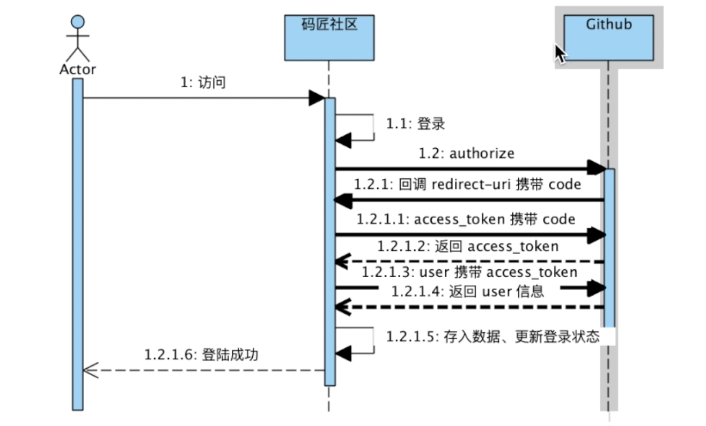

## spring 初识

### 创建 springboot 项目

1. IDEA 创建项目
   > 通过 idea--->maven 生成
   > 
2. 生成后的目录
   
3. 对应的 pom 文件

```
<?xml version="1.0" encoding="UTF-8"?>
<project xmlns="http://maven.apache.org/POM/4.0.0" xmlns:xsi="http://www.w3.org/2001/XMLSchema-instance"
         xsi:schemaLocation="http://maven.apache.org/POM/4.0.0 https://maven.apache.org/xsd/maven-4.0.0.xsd">
    <modelVersion>4.0.0</modelVersion>
    <parent>
        <groupId>org.springframework.boot</groupId>
        <artifactId>spring-boot-starter-parent</artifactId>
        <version>2.2.2.RELEASE</version>
        <relativePath/> <!-- lookup parent from repository -->
    </parent>
    <groupId>com.jialiang</groupId>
    <artifactId>mycommunity</artifactId>
    <version>0.0.1-SNAPSHOT</version>
    <name>mycommunity</name>
    <description>mycommunity</description>

    <properties>
        <java.version>1.8</java.version>
    </properties>

    <dependencies>
        <dependency>
            <groupId>org.springframework.boot</groupId>
            <artifactId>spring-boot-starter-web</artifactId>
        </dependency>
        <dependency>
            <groupId>org.springframework.boot</groupId>
            <artifactId>spring-boot-starter-test</artifactId>
            <scope>test</scope>
            <exclusions>
                <exclusion>
                    <groupId>org.junit.vintage</groupId>
                    <artifactId>junit-vintage-engine</artifactId>
                </exclusion>
            </exclusions>
        </dependency>
    </dependencies>

    <build>
        <plugins>
            <plugin>
                <groupId>org.springframework.boot</groupId>
                <artifactId>spring-boot-maven-plugin</artifactId>
            </plugin>
        </plugins>
    </build>
</project>
```

4. 添加 controller

```
package com.jialiang.mycommunity.controller;

import org.springframework.stereotype.Controller;
import org.springframework.ui.Model;
import org.springframework.web.bind.annotation.GetMapping;
import org.springframework.web.bind.annotation.RequestParam;

@Controller
public class HelloController {


    @GetMapping("/hello")
    public String hello(@RequestParam(name = "name")   String name, Model model){
        //浏览器将数据给到后端---->后端接收----->渲染到模板

   model.addAttribute("name",name);

return  "hello";  //这个时候会去找hello的模板
    }
}

```

5. templates 使用

> 首先需要在 pom 文件中增加如下依赖

```
 <dependency>
            <groupId>org.springframework.boot</groupId>
            <artifactId>spring-boot-starter-thymeleaf</artifactId>
        </dependency>

```

> 然后在 resouces.templates 中添加对应的 html

```
<!DOCTYPE html>
<html lang="en" xmlns:th="http://www.w3.org/1999/xhtml">
<head>
    <meta charset="UTF-8">
    <title>hello</title>
</head>
<body>


<p th:text="'Hello, ' + ${name} + '!'" />


</body>
</html>
```

此时启动项目：访问http://localhost:8090/hello?name=helloworld


### 引入 bootstrap，用组件编写首页和导航栏

1. 首先在 bootstrap 官网下载对应的资源文件，下载完成后导入到项目中
   
2. 另外在 pom 中添加入下语句

```
 <build>
        <plugins>
            <plugin>
                <groupId>org.springframework.boot</groupId>
                <artifactId>spring-boot-maven-plugin</artifactId>
            </plugin>
        </plugins>
        <resources>
            <resource>
                <directory>src/main/java</directory>
                <includes>
                    <include>**/*.xml</include>
                </includes>
            </resource>
            <resource>
                <directory>src/main/resources</directory>
            </resource>
        </resources>
    </build>
```

3. index.html

```
<!DOCTYPE html>
<html lang="en" xmlns:th="http://www.w3.org/1999/xhtml">
<head>
    <meta charset="UTF-8">
    <title>jeremy的首页</title>
    <link  rel="stylesheet"  href="css/bootstrap.min.css" />
    <link  rel="stylesheet"  href="css/bootstrap-theme.min.css" />
    <script src="js/bootstrap.min.js" type="application/javascript"></script>


</head>
<body>
<nav class="navbar navbar-default">
    <div class="container-fluid">
        <!-- Brand and toggle get grouped for better mobile display -->
        <div class="navbar-header">
            <button type="button" class="navbar-toggle collapsed" data-toggle="collapse" data-target="#bs-example-navbar-collapse-1" aria-expanded="false">
                <span class="sr-only">jeremy社区</span>
            </button>
            <a class="navbar-brand" href="#">jeremy的小屋</a>
        </div>

        <div class="collapse navbar-collapse" id="bs-example-navbar-collapse-1">
            <form class="navbar-form navbar-left">
                <div class="form-group">
                    <input type="text" class="form-control" placeholder="搜索问题">
                </div>
                <button type="submit" class="btn btn-default">搜索</button>
            </form>
            <ul class="nav navbar-nav navbar-right">
                <li><a href="#">登录</a></li>
                <li class="dropdown">
                    <a href="#" class="dropdown-toggle" data-toggle="dropdown" role="button" aria-haspopup="true" aria-expanded="false">我的信息 <span class="caret"></span></a>
                    <ul class="dropdown-menu">
                        <li><a href="#">消息</a></li>
                        <li><a href="#">个人资料</a></li>
                        <li><a href="#">退出</a></li>
                    </ul>
                </li>
            </ul>
        </div>
    </div>
</nav>

</body>
</html>
```

4. 编写对应的 controller

```
@Controller
public class IndexController {
    @GetMapping("/")
    public String index(){
        return "index";
    }
}
```

### 接入 github 登录功能

Visual Paradigm

#### 登陆 github 并注册一个 oauth

接入流程

> https://developer.github.com/apps/building-oauth-apps/authorizing-oauth-apps/

1. 找到 settings
   
2. developer settings
   

3. new oauth app
   

4. 获取 client_id 和 client_secret 填写应用信息

5. github 登录时序图
   

6. 开始编码

> GET https://github.com/login/oauth/authorize

首先用户点击登录接口---访问

```
                <li><a href="https://github.com/login/oauth/authorize?client_id=Iv1.db24061628c19aa7&redirect_uri=http://localhost:8090/callback&scop=user&state=1 ">登录</a></li>

```

```
根据code获取access_token

POST https://github.com/login/oauth/access_token

需要传递5个参数
public class AccessTokenDTO {

private  String client_id;
private String client_secret;
private String code;
private  String redirect_uri;
private  String state;
```

调取 POST https://github.com/login/oauth/access_token
获取 token

```
 AccessTokenDTO accessTokenDTO = new AccessTokenDTO();
        accessTokenDTO.setCode(code);
        accessTokenDTO.setRedirect_uri("http://localhost:8090/callback");
        accessTokenDTO.setState(state);
        accessTokenDTO.setClient_id(clientId);
        accessTokenDTO.setClient_secret(clientSecret);
        String accessToken=githubProvider.getAccessToken(accessTokenDTO);


      public String getAccessToken(AccessTokenDTO accessTokenDTO){

        MediaType mediaType
                = MediaType.get("application/json; charset=utf-8");

        OkHttpClient client = new OkHttpClient();

//https://github.com/login/oauth/access_token
            RequestBody body = RequestBody.create(mediaType, JSON.toJSONString(accessTokenDTO));
            Request request = new Request.Builder()
                    .url("https://github.com/login/oauth/access_token")
                    .post(body)
                    .build();
            try (Response response = client.newCall(request).execute()) {
                String str=response.body().string();

               String asscessToken= str.split("&")[0].split("=")[1];
                System.out.println(asscessToken);
                return asscessToken;

            } catch (IOException e) {
                e.printStackTrace();
            }
            return  null;

    }
```

再根据 token 获取 github user 信息

```
public GithubUser  getUser(String accessToken){
        OkHttpClient client = new OkHttpClient();

//https://github.com/login/oauth/access_token
        Request request = new Request.Builder()
                .url("https://api.github.com/user?access_token="+accessToken)
                .build();
        try {
            Response response = client.newCall(request).execute();
            String str=response.body().string();
            System.out.println("aaaaa:"+str);
            GithubUser githubUser = com.alibaba.fastjson.JSON.parseObject(str, GithubUser.class);
            System.out.println(githubUser);
            return  githubUser;
        } catch (IOException e) {
            e.printStackTrace();
        }
        return  null;

    }
```

7.session 和 token

> 在通过 accessToken 获取到用户信息后,就将 user 放到 session 中，让前端从 session 获取 session
> 后端将信息存入 session

```
  GithubUser githubUser=githubProvider.getUser(accessToken);
        if(githubUser!=null){
            //登入成功写入cokkie 和session
          //seesion是在哪里拿到的，是在httpRequest中拿到的，在此处使用HttpServletRequest，soring会自动注入属性，获取到
            // 上下文对象
           request.getSession().setAttribute("user",githubUser);
           //此时有了登录态
            //跳转到首页,重定向，
            return "redirect:index";

        }else
        {
            return "redirect:index";

        }
```

前端，从 session 获取信息，并判断

```
<span th:text="${session.sessionUser.userName}"></span>
```

#### flyway 工具介绍
